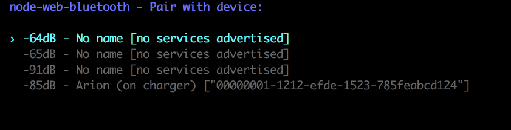

[](https://travis-ci.org/IjzerenHein/node-web-bluetooth) [](https://raw.githubusercontent.com/IjzerenHein/node-web-bluetooth/master/LICENSE.txt)

Web Bluetooth API and interactive device picker for node.js, using the awesome [noble](https://github.com/sandeepmistry/noble) package

## Installation

	npm install node-web-bluetooth
	
This will automatically install [noble](https://github.com/sandeepmistry/noble). Depending on your system environment and the tools installed, nobble may or may not work out of the box. Please visit [https://github.com/sandeepmistry/noble](https://github.com/sandeepmistry/noble) on how to install all the prerequisites for noble.

## Usage

```js
const Bluetooth	= require('node-web-bluetooth');

async function connect() {
	const device = await Bluetooth.requestDevice({
		filters: [
			{services: ['heart_rate']}
		]
	});
	const server = await device.connect();
	const service = await server.getPrimaryService('heart_rate');
	const char = await service.getCharacteristic('heart_rate_measurement');
	await char.startNotifications();
	char.on('characteristicvaluechanged', (data) => {
		// parse heart-rate data here
	});
	...
	await char.stopNotifications();
	await server.disconnect();
}
connect();
```



## Programmatically selecting a device

By default, `Bluetooth.requestDevice` shows an interactive list
with all the discovered devices it has found. To programmatically
control the selected device, you can pass in an instance of the `RequestDeviceDelegate` class.

```js
const Bluetooth	= require('node-web-bluetooth');

class SelectFirstFoundDevice extends Bluetooth.RequestDeviceDelegate {

	// Select first device found
	onAddDevice(device) {
		this.resolve(device);
	}
	onUpdateDevice(device) {
		// Called whenever new advertisement data was received
		// for the device
	}

	// Time-out when device hasn't been found in 20 secs
	onStartScan() {
		this._timer = setTimeout(() => {
			this.reject(new Error('No device found'));
		}, 20000);
	}
	onStopScan() {
		if (this._timer) clearTimeout(this._timer);
	}
}

async function connect() {
	const device = await Bluetooth.requestDevice({
		filters: [
			{services: ['heart_rate']}
		],
		delegate: new SelectFirstFoundDevice()
	});
	...
}
connect();
```

## Customizing the interactive device picker

The header-text and the formatting of the interactive device picker are customizable. To fully customize it, derive a class from it and override its methods.

```js
const Bluetooth	= require('node-web-bluetooth');

const device = Bluetooth.requestDevice({
	delegate: new Bluetooth.InteractiveRequestDeviceDelegate({
		header: 'Set your custom header text here',
		format: (device) => `${device.id} - ${device.name}`
	})
});
```

## `navigator.bluetooth` compatibility

In order to achieve full code compatibility with browser code, `navigator.bluetooth` is injected into the global scope.
In case the `navigator` object already existed, it is 
extended with the `bluetooth` object. Causing this to work:

```js
require('node-web-bluetooth');

navigator.bluetooth.requestDevice({
	...
});
```

# Work in progress...
**node-web-bluetooth** is being built as you read this. Nearly all 
of the core API's are done but more testing is still needed. 
Go ahead and give it a try, and let us know if you run into any problems.

- [x] Bluetooth.requestDevice()
- [x] Bluetooth.getAvailability()
- [x] Bluetooth.availabilitychanged
- [ ] ~~Bluetooth.referringDevice~~ (not relevant)
- [x] BluetoothDevice.id
- [x] BluetoothDevice.name
- [x] BluetoothDevice.gatt
- [x] BluetoothDevice.uuids
- [x] BluetoothDevice.gattserverdisconnected
- [ ] BluetoothDevice.watchAdvertisements()
- [ ] BluetoothDevice.advertisementreceived()
- [x] BluetoothRemoteGATTServer.device
- [x] BluetoothRemoteGATTServer.connected
- [x] BluetoothRemoteGATTServer.connect()
- [x] BluetoothRemoteGATTServer.disconnect()
- [x] BluetoothRemoteGATTServer.getPrimaryService()
- [x] BluetoothRemoteGATTServer.getPrimaryServices()
- [x] BluetoothRemoteGATTService.uuid
- [x] BluetoothRemoteGATTService.isPrimary
- [x] BluetoothRemoteGATTService.device
- [x] BluetoothRemoteGATTService.getCharacteristic()
- [x] BluetoothRemoteGATTService.getCharacteristics()
- [x] BluetoothRemoteGATTService.getIncludedService()
- [x] BluetoothRemoteGATTService.getIncludedServices()
- [ ] BluetoothRemoteGATTService.serviceadded
- [ ] BluetoothRemoteGATTService.servicechanged
- [ ] BluetoothRemoteGATTService.serviceremoved
- [x] BluetoothRemoteGATTCharacteristic.service
- [x] BluetoothRemoteGATTCharacteristic.uuid
- [x] BluetoothRemoteGATTCharacteristic.properties
- [x] BluetoothRemoteGATTCharacteristic.value
- [x] BluetoothRemoteGATTCharacteristic.getDescriptor()
- [x] BluetoothRemoteGATTCharacteristic.getDescriptors()
- [x] BluetoothRemoteGATTCharacteristic.readValue()
- [x] BluetoothRemoteGATTCharacteristic.writeValue()
- [x] BluetoothRemoteGATTCharacteristic.startNotifications()
- [x] BluetoothRemoteGATTCharacteristic.stopNotifications()
- [x] BluetoothRemoteGATTCharacteristic.characteristicvaluechanged
- [x] BluetoothRemoteGATTDescriptor.characteristic
- [x] BluetoothRemoteGATTDescriptor.uuid
- [x] BluetoothRemoteGATTDescriptor.value
- [x] BluetoothRemoteGATTDescriptor.readValue
- [x] BluetoothRemoteGATTDescriptor.writeValue
- [x] Translate characteric names to UUIDs
- [x] Translate descriptor names to UUIDs

## Known issues

Due to an implementation restriction in noble, calling `BluetoothRemoteGATTService.getCharacteristic(s)` multiple times doesn't work correctly. If you need to obtain multiple characterstics, then do it using a 
single call to `BluetoothRemoteGATTService.getCharacteristics`.

## Resources

- [https://webbluetoothcg.github.io/web-bluetooth](https://webbluetoothcg.github.io/web-bluetooth)
- [https://github.com/WebBluetoothCG/demos](https://github.com/WebBluetoothCG/demos)
- [https://developer.mozilla.org/en-US/docs/Web/API/Web_Bluetooth_API](https://developer.mozilla.org/en-US/docs/Web/API/Web_Bluetooth_API)

## License

[MIT](./LICENSE.txt)
